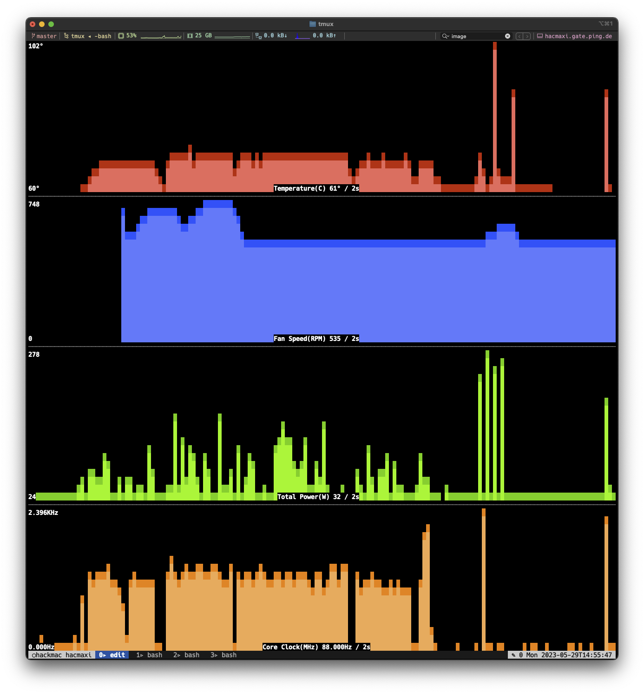

# HackMac

## Description

Some ruby tools for working with a Hackintosh, which also might be (partially)
useful an a regular Mac.

HackMac is a set of Ruby tools specifically designed for managing and
customizing Hackintosh configurations. While primarily intended for users with
Hackintosh setups, it may also be useful for ordinary Mac users who want to
leverage its features for monitoring system performance using `gfxmon`.

## Tools

 - `efi` is a tool to work with OpenCore EFI partitions, that is upgrading
   OpenCore and Kexts and commiting to its git repository.
 - `usb` can be used to create a bootable USB containing a MacOs release and
   uses an EFI partition cloned from a git repository.
 - `gfxmon` dispays performance statistics for your AMD GPU in the terminal,
   that is temperature, clock rate, fan rotations, memory and power usage as
   provided by MacOS, see the screenshot:
   

## Installation

You can use rubygems to fetch the gem and install it for you:

    # gem install hackmac

You can also put this line into your Gemfile

    gem 'hackmac'

# Configuration

First start `efi` without arguments this will display the available commands,
but also initializes a default configuration file in
`~/.config/hackmac/hackmac.yml` to get you started. If you want work with
multiple configuration files you can change the path by setting

```
$ export HACKMAC_CONFIG=~/config/hackmac/other.yml
```

in your shell.

## Download

The homepage of this library is located at

* https://github.com/flori/hackmac

## Author

[Florian Frank](mailto:flori@ping.de)

## License

This software is licensed under the MIT license.
